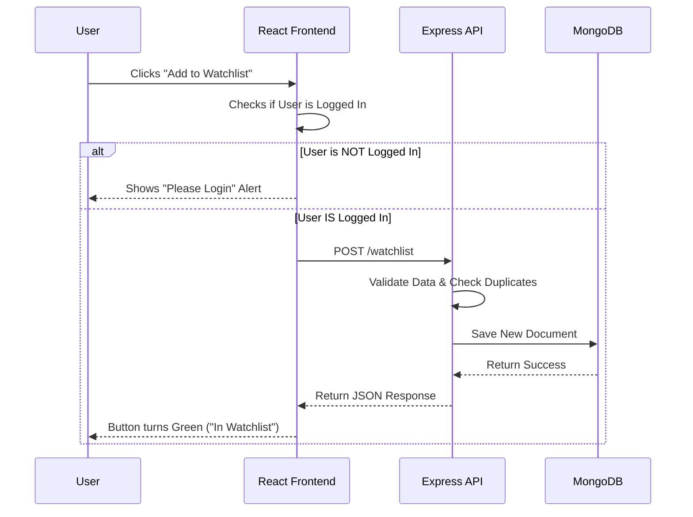

# Movie Recommendation Engine Capstone

**Status:** Deployed & Live 🟢
**Live URL:** https://icsi518-480619.uk.r.appspot.com/
**Video Demo:** [PASTE YOUR YOUTUBE/DRIVE LINK HERE]

## Overview
A full-stack MERN application (MongoDB, Express, React, Node) allowing users to browse movies via the TMDB API, log in via Google OAuth, and manage a personalized watchlist stored in MongoDB Atlas.

This project is deployed as a unified service on **Google App Engine**.

## Architecture & Design Patterns
This project follows a professional architectural approach:

### 1. Component-Based Architecture (Frontend)
* **Tech:** React (Vite), TailwindCSS, Framer Motion.
* **Pattern:** UI logic is separated into reusable components (`MovieCard`, `ReviewForm`), using `useSWR` for state management and caching.

### 2. MVC (Model-View-Controller) Adaptation (Backend)
* **Tech:** Express.js, Node.js.
* **Model:** Mongoose Schemas (`Review.js`, `WatchlistItem.js`) define data structure and validation.
* **Controller:** REST API routes handle business logic (CRUD operations).
* **View:** JSON responses serve as the data view consumed by the React client.

### 3. Unified Deployment
* **Pattern:** The React frontend is built into static files and served by the Express backend, allowing both to run on a single Google App Engine instance.

## Instructions to Run the Code

### Option A: Run Locally (Development Mode)
Use this for editing code. It uses a Vite Proxy to connect Frontend to Backend.

1.  **Open in VS Code Dev Container:**
    * Ensure Docker Desktop is running.
    * Open folder in VS Code -> Reopen in Container.

2.  **Install Dependencies:**
    ```bash
    npm install
    cd client && npm install
    cd ../server && npm install
    ```

3.  **Start the Backend (Terminal 1):**
    ```bash
    cd server
    npm run dev
    ```

4.  **Start the Frontend (Terminal 2):**
    ```bash
    cd client
    npm run dev
    ```
    * Access at: `http://localhost:5173`

### Option B: Deploy to Google Cloud (Production)
Use this to update the live website.

1.  **Build the Frontend:**
    ```bash
    cd client && npm run build
    ```

2.  **Copy Build to Server:**
    ```bash
    cp -r dist ../server/
    ```

3.  **Deploy:**
    ```bash
    cd ../server
    gcloud app deploy
    ```

## Automated Testing
This project includes automated End-to-End (E2E) testing using **Playwright**.

* **Test File:** `tests/homepage.spec.js`
* **Scope:** Verifies the application loads, the title is correct, authentication buttons appear, and the movie grid fetches data.

**How to Run Tests:**
1.  Ensure the local server is running (`npm run dev`).
2.  Run the test suite:
    ```bash
    npx playwright test
    ```

## Design Artifact: Sequence Diagram
**Scenario:** User adds a movie to their Watchlist.

