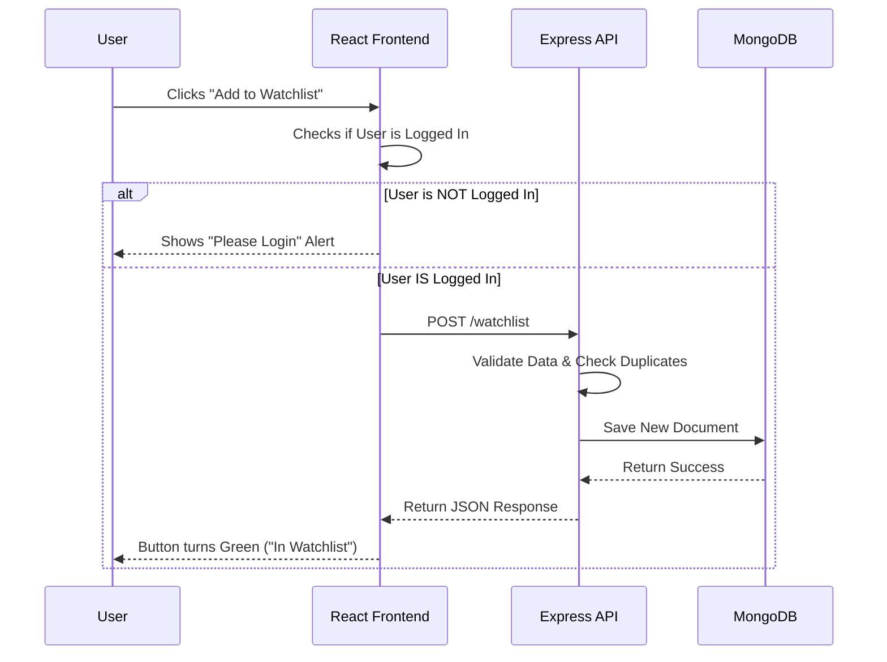

# Movie Recommendation Engine Capstone

## Overview

A full-stack MERN application (MongoDB, Express, React, Node) allowing users to browse movies, log in via Google, and manage a personalized watchlist.

## Architecture

* **Frontend:** React (Vite), TailwindCSS, Framer Motion

* **Backend:** Express.js, REST API

* **Database:** MongoDB Atlas

* **Auth:** Firebase (Google OAuth)

## How to Run

1. Open this folder in VS Code.

2. Ensure Docker Desktop is running.

3. Click "Reopen in Container" when prompted.

4. Run `npm install` in both `/client` and `/server`.

5. Start Backend: `cd server && npm run dev`

6. Start Frontend: `cd client && npm run dev`

## System Architecture

### "Add to Watchlist" Sequence Diagram

This diagram illustrates the data flow when a user saves a movie to their personal list.

## Design Patterns

This project utilizes two core architectural patterns:

### 1. Component-Based Architecture (Frontend)
The React frontend breaks the UI into independent, reusable pieces (e.g., `MovieCard`, `ReviewForm`). This ensures isolation of logic and styles, making the interface easier to maintain and test.

### 2. MVC (Model-View-Controller) Adaptation (Backend)
The Express backend follows an MVC-style separation of concerns:
* **Model:** Mongoose Schemas (`Review.js`, `WatchlistItem.js`) define the data structure.
* **Controller:** The route handlers in `index.js` manage the logic (CRUD operations).
* **View:** The JSON responses serve as the data view consumed by the React client.

### 3. RESTful API
The client and server communicate via a REST API, using standard HTTP methods (GET, POST, PUT, DELETE) to manage resources.