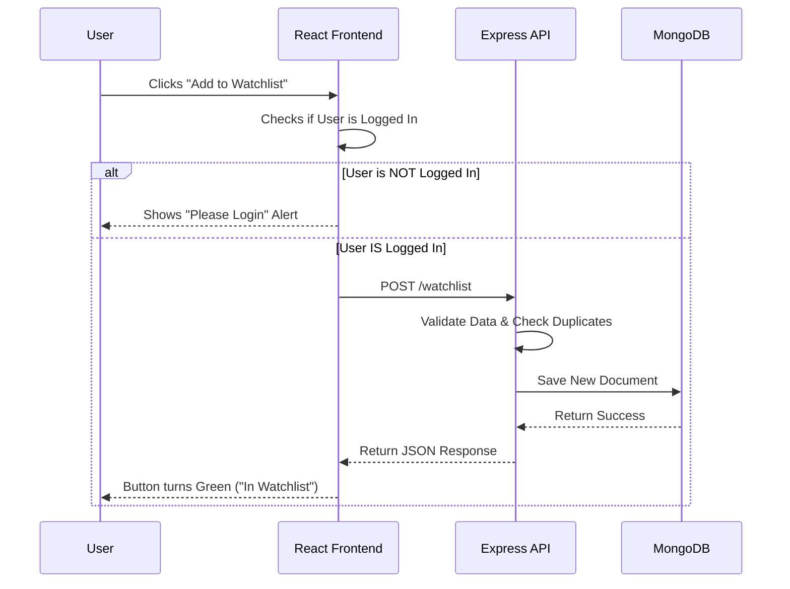

# Movie Recommendation Engine Capstone

**Status:** Deployed & Live 🟢
**Live URL:** https://icsi518-480619.uk.r.appspot.com/
**Video Demo:** [PASTE YOUR YOUTUBE/DRIVE LINK HERE]

## Overview
A full-stack MERN application (MongoDB, Express, React, Node) allowing users to browse movies via the TMDB API, log in via Google OAuth, and manage a personalized watchlist stored in MongoDB Atlas.

This project is deployed as a unified service on **Google App Engine**.

# Design Patterns

This project utilizes professional architectural patterns to ensure scalability and maintainability:

### 1. Component-Based Architecture (Frontend)
The React frontend breaks the UI into independent, reusable pieces (e.g., `MovieCard`, `ReviewForm`).
* **State Management:** Utilizes `useSWR` (Stale-While-Revalidate) for efficient server-state synchronization, caching, and automatic background revalidation.
* **Build Strategy:** The frontend is compiled into optimized static assets (`dist` folder) rather than running as a separate node process in production.

### 2. MVC (Model-View-Controller) Adaptation (Backend)
The Express backend follows an MVC-style separation of concerns:
* **Model:** Mongoose Schemas (`Review.js`, `WatchlistItem.js`) define the data structure and validation logic.
* **Controller:** REST API route handlers manage business logic (CRUD operations) and request validation.
* **View:** The backend serves two types of views: JSON responses for API calls and the compiled React `index.html` for client-side navigation.

### 3. Unified Service Architecture
Instead of deploying separate frontend and backend servers, this project implements a **Unified Deployment** pattern:
* The Express server acts as the single entry point, handling both API requests (e.g., `/reviews`) and serving the static React files.
* This architecture eliminates CORS issues in production and allows the entire full-stack application to run on a single Google App Engine instance.

## Instructions to Run the Code

### Option A: Run Locally (Development Mode)
Use this for editing code. It uses a Vite Proxy to connect Frontend to Backend.

1.  **Open in VS Code Dev Container:**
    * Ensure Docker Desktop is running.
    * Open folder in VS Code -> Reopen in Container.

2.  **Install Dependencies:**
    ```bash
    npm install
    cd client && npm install
    cd ../server && npm install
    ```

3.  **Start the Backend (Terminal 1):**
    ```bash
    cd server
    npm run dev
    ```

4.  **Start the Frontend (Terminal 2):**
    ```bash
    cd client
    npm run dev
    ```
    * Access at: `http://localhost:5173`

### Option B: Deploy to Google Cloud (Production)
Use this to update the live website.

1.  **Build the Frontend:**
    ```bash
    cd client && npm run build
    ```

2.  **Copy Build to Server:**
    ```bash
    cp -r dist ../server/
    ```

3.  **Deploy:**
    ```bash
    cd ../server
    gcloud app deploy
    ```

## Automated Testing
This project includes automated End-to-End (E2E) testing using **Playwright**.

* **Test File:** `tests/homepage.spec.js`
* **Scope:** Verifies the application loads, the title is correct, authentication buttons appear, and the movie grid fetches data.

**How to Run Tests:**
1.  Ensure the local server is running (`npm run dev`).
2.  Run the test suite:
    ```bash
    npx playwright test
    ```

## Design Artifact: Sequence Diagram
**Scenario:** User adds a movie to their Watchlist.


## Acknowledgments
* **AI Assistance:** Development supported by **Google Gemini**.